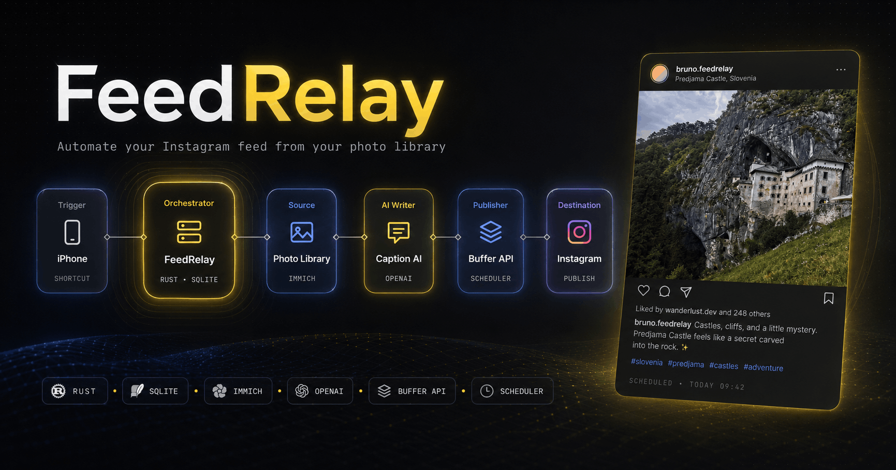
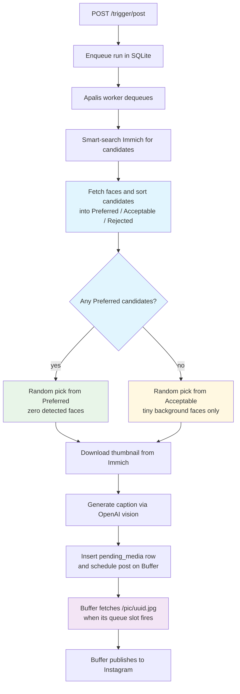

<p align="center"><br></p>
<h2 align="center">FeedRelay</h2>
<p align="center">
    Your personal automation service that picks a photo from an <a href="https://immich.app">Immich</a> library, generates an Instagram caption with OpenAI, and schedules the post via the <a href="https://developers.buffer.com/">Buffer API</a>.
</p>


## Architecture

FeedRelay is a single Rust binary. An actix-web server handles two endpoints — `POST /trigger/post` (kicks off a run) and `GET /pic/<uuid>.jpg` (serves images to Buffer). An [Apalis](https://github.com/geofmureithi/apalis) worker runs in the same process, backed by the same SQLite database that stores audit rows. Everything that needs to survive a restart (job queue, run history, scheduled-post audit, pending images) lives in one SQLite file.

<details>
<summary>Pipeline diagram</summary>



</details>

A few things in the diagram are worth calling out:

- **`/trigger/post` returns fast.** It only writes a `runs` row and enqueues an Apalis job. The real work happens on the worker thread.
- **The face filter is a two-tier classifier.** Step 2 fetches face bounding boxes for each candidate; the pipeline prefers assets with zero detected faces and only falls back to assets with very small (background-only) faces when the preferred tier is empty. See `src/filter.rs`.
- **Buffer fetches the image asynchronously.** When the worker schedules a post (step 5), it gives Buffer a `/pic/<uuid>.jpg` URL pointing back at this service. Buffer fetches that URL later, when the post's queue slot fires (step 6) — which means feedrelay has to be publicly reachable for Buffer's servers. The `pending_media` row holds the image bytes until then; expired rows get cleaned up on the next run.

See `plans/prd_feedrelay_web_server.md` for the full design rationale and decision log.

## Local development

1. Copy `.env.example` to `.env` and fill in all required keys.
2. Run the server:

```bash
cargo run
```

The server binds to `0.0.0.0:8080` by default. `DATABASE_URL` must point to a writable path; `sqlite://./feedrelay-dev.db` works locally.

Check health:

```bash
curl http://localhost:8080/management/health
```

Trigger a post (requires `SHORTCUT_TOKEN`):

```bash
curl -X POST http://localhost:8080/trigger/post \
  -H "Authorization: Bearer $SHORTCUT_TOKEN"
```

## Deployment

The production image is published to GHCR:

```
ghcr.io/brunojppb/feedrelay:latest
```

For a one-off deployment without compose, pull the image and run it directly:

```bash
docker run -d \
  --name feedrelay \
  -p 8080:8080 \
  -v "$(pwd)/feedrelay-data:/data" \
  --env-file .env \
  --restart unless-stopped \
  ghcr.io/brunojppb/feedrelay:latest
```

- `-p 8080:8080` — exposes the HTTP server. Put a reverse proxy (Traefik, Caddy, nginx) in front for TLS; Buffer needs to reach `PUBLIC_BASE_URL` over the public internet to fetch `/pic/<uuid>.jpg`.
- `-v "$(pwd)/feedrelay-data:/data"` — persists the SQLite database. Set `DATABASE_URL=sqlite:///data/feedrelay.db` in `.env` so the file lands in the mounted volume.
- `--env-file .env` — loads all configuration. See the [Configuration](#configuration) table above for the full list of variables and which are required.

Update with `docker pull ghcr.io/brunojppb/feedrelay:latest && docker restart feedrelay`.

### On the home server

```bash
# First time
mkdir -p feedrelay-data
cp .env.example .env   # fill in secrets
docker compose up -d

# Update
docker compose pull && docker compose up -d
```

The compose file assumes an external Traefik network named `traefik`. The service is reachable at the host configured in `docker-compose.yml` (default placeholder: `feedrelay.example.com`) via your reverse proxy → container (port 8080).

### Building the image manually

```bash
docker build -t ghcr.io/brunojppb/feedrelay:latest .
docker push ghcr.io/brunojppb/feedrelay:latest
```

## Configuration

All configuration is via environment variables. Copy `.env.example` to `.env` and fill in the blanks.

| Variable | Default | Required | Description |
|---|---|---|---|
| `PORT` | `8080` | no | HTTP port |
| `RUST_LOG` | `feedrelay=debug,info` | no | Log filter |
| `DATABASE_URL` | — | **yes** | SQLite URL e.g. `sqlite:///data/feedrelay.db` |
| `SHORTCUT_TOKEN` | — | **yes** | Bearer token for `/trigger/*` endpoints |
| `IMMICH_BASE_URL` | — | **yes** | Immich instance URL |
| `IMMICH_API_KEY` | — | **yes** | Immich API key |
| `IMMICH_DEFAULT_QUERY` | `landscape architecture nature scenery` | no | CLIP smart-search query |
| `IMMICH_CANDIDATE_POOL_SIZE` | `50` | no | Max assets per search call |
| `IMMICH_LOOKBACK_DAYS` | `365` | no | Rolling window for `takenAfter` |
| `FACE_AREA_PER_FACE_PCT` | `3.0` | no | Max single face area (% of image) |
| `FACE_AREA_TOTAL_PCT` | `8.0` | no | Max combined face area (% of image) |
| `OPENAI_API_KEY` | — | **yes** | OpenAI API key |
| `OPENAI_MODEL` | `gpt-5.4-mini` | no | OpenAI model for caption generation |
| `BUFFER_API_KEY` | — | **yes** | Buffer API key |
| `BUFFER_GRAPHQL_URL` | `https://api.buffer.com` | no | Buffer GraphQL endpoint |
| `BUFFER_INSTAGRAM_CHANNEL_ID` | — | **yes** | Buffer Instagram channel ID |
| `PUBLIC_BASE_URL` | — | **yes** | Public URL for `/pic/<uuid>.jpg` links Buffer will fetch (e.g. `https://feedrelay.example.com`) |
| `PENDING_MEDIA_TTL_MINUTES` | `60` | no | Lifetime of pending media rows |

## Immich prerequisite: preview format must be JPEG

**This is the most common deployment gotcha.** FeedRelay fetches the Immich preview image and sends it inline to OpenAI as a JPEG. If Immich is configured to generate WebP previews, the pipeline will fail silently (OpenAI receives a WebP file labelled as JPEG and may return an error or a bad caption).

Fix:

1. Log into Immich as admin.
2. Go to **Administration → System Settings → Image**.
3. Under **Preview**, set **Format** to **JPEG** (not WebP).
4. Click **Save**.
5. Optionally regenerate existing thumbnails via **Administration → Jobs → Generate Thumbnails**.

## Operations

**Logs** — structured JSON to stdout:

```bash
docker logs -f feedrelay
```

**Health check:**

```bash
curl https://feedrelay.example.com/management/health
# → {"status":"ok"}
```

**Graceful shutdown** — send SIGTERM; actix-web drains in-flight requests automatically:

```bash
docker compose stop feedrelay   # sends SIGTERM, waits for drain
```

**Database backup** — back up the SQLite file on the host:

```bash
cp feedrelay-data/feedrelay.db feedrelay-data/feedrelay.db.bak
# or use SQLite's online backup:
sqlite3 feedrelay-data/feedrelay.db ".backup 'backup.db'"
```

**Stuck jobs** — if the process is killed mid-pipeline, the `runs` row may remain in `running` state. Restart the service; the Apalis worker will pick up pending jobs from the queue. Stuck-run cleanup at startup is noted as future work in the PRD.
