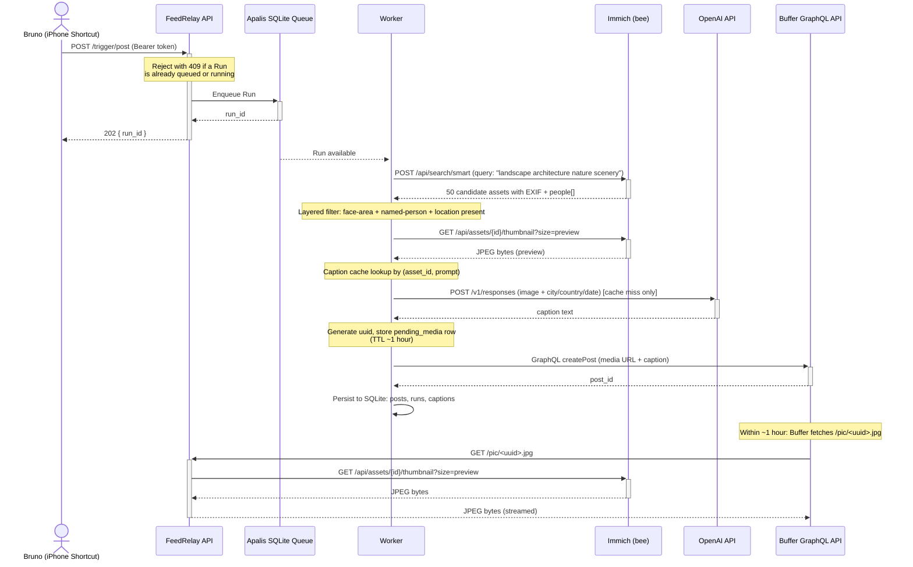

# FeedRelay PRD

> A Rust web service that picks a random people-free photo from a personal Immich library, captions it via OpenAI, and schedules an Instagram post through Buffer's API. Triggered from iPhone Shortcuts.

**Status:** Draft v1.2
**Owner:** Bruno Paulino
**Last updated:** 2026-05-24 (revised: domain language, queue-from-day-one, stateless retry + caption cache, layered filter, dry_run dropped, OTel deferred)

> Canonical glossary lives in [`CONTEXT.md`](../CONTEXT.md); foundational architectural decisions in [`docs/adr/`](../docs/adr/). This PRD is the implementation-level spec; when terminology drifts, `CONTEXT.md` wins.

---

## 1. Goal

Turn the act of "I have thousands of travel photos sitting on my home server" into a one-tap action: open Shortcuts, tap a button, and a new Instagram post lands in Buffer's queue within a minute or two. No browsing. No picking. No writing. Just a tap.

## 2. Non-goals

- Not a general-purpose social media tool. Single user (me), single channel (Instagram), single image at a time.
- Not a Buffer or Immich replacement. Thin glue layer.
- No carousels in v1. No video. No stories. No reels.
- No web UI for v1. The "UI" is the iPhone Shortcut and Buffer's own dashboard.
- No manual review / approval queue. If a generated post is bad, edit it in Buffer before it publishes.

## 3. User flow

```
1. Bruno taps "Schedule travel post" on iPhone Shortcuts
2. Shortcut POSTs to https://feedrelay.example.com/trigger/post
   with a Bearer token
3. FeedRelay enqueues a Run and returns 202 with a run_id
   (or 409 + existing run_id if a Run is already in flight — see Section 5)
4. Shortcut shows a notification: "Run queued: <id>"
   (or "Already in flight: <id>" on 409)
5. Worker picks up the Run:
   a. Hits Immich smart search for travel/landscape/architecture photos
   b. Applies the layered people-aware filter (see Section 7)
   c. Picks one Candidate at random from the survivors
   d. Looks up the (asset_id, prompt) caption cache; if miss, calls OpenAI
   e. Generates a public-facing URL: https://feedrelay.example.com/pic/<uuid>.jpg
   f. Calls Buffer's GraphQL API to schedule the Post
   g. Persists the Run audit row + Post dedup row to SQLite
6. Buffer publishes the Post at the next slot (or the configured time)
```

Failure modes surface in two ways: the worker writes structured `tracing` events to stdout, and a follow-up `GET /trigger/status/<run_id>` returns success/failure with details. The Shortcut can optionally poll once after 60 seconds to confirm.

Retries are stateless: if Apalis re-runs the handler, the candidate pick and Buffer call re-execute from scratch. The only state preserved across attempts is the `captions` cache (see Section 6) — so OpenAI is paid at most once per `(asset, prompt)` pair.

## 4. System architecture



The key insight: Buffer does not accept direct uploads. Media must be hosted at a public URL. FeedRelay acts as the public face, proxying bytes from Immich on demand. Buffer fetches the URL during (or shortly after) the `createPost` mutation, so the URL only needs to be live for a short window — TTL of one hour is comfortable. Immich itself stays behind Tailscale on the home network.

## 5. API surface

### `GET /management/health`
No auth. Returns `200 OK` with a JSON body indicating DB connectivity and Apalis worker health. Used by Docker healthcheck and uptime monitoring.

### `GET /pic/{uuid}.jpg`
No auth (must be public for Buffer to fetch). Looks up `uuid` in `pending_media`. If found and not expired, streams the corresponding Immich asset's **JPEG preview** (via `/api/assets/{id}/thumbnail?size=preview`, not `/original`). The JPEG guarantee depends on Immich's preview format setting (default JPEG) — see README deployment notes. If expired or unknown, returns `404`. Sets `Cache-Control: public, max-age=300` (well under the row's ~1h TTL) and an `ETag` based on the Immich asset ID.

**Security note:** UUIDs are v4 random, so this is unguessable. Combined with the short (~1h) TTL, the exposure window is small. Acceptable trade-off given the use case (photos that are about to be public on Instagram anyway).

### `POST /trigger/post`
Auth: `Authorization: Bearer <SHORTCUT_TOKEN>`.

Request:
```json
{
  "query_hint": "mountain landscape"
}
```

`query_hint` is optional and overrides the default CLIP query.

Response (202) — Run enqueued:
```json
{
  "run_id": "01HNXY...",
  "status_url": "/trigger/status/01HNXY..."
}
```

Response (409) — a Run is already `queued` or `running`. The body returns the existing run reference so the Shortcut can show "Already in flight":
```json
{
  "run_id": "01HNXX...",
  "status_url": "/trigger/status/01HNXX...",
  "reason": "run_already_in_flight"
}
```

Only one Run may be in flight at a time. This is a deliberate single-user invariant — it absorbs slow-network double-taps and Shortcut auto-retries without spawning duplicate posts.

### `GET /trigger/status/{run_id}`
Auth: same Bearer token. Returns current Run state: `queued`, `running`, `succeeded`, `failed`, plus payload if completed (`buffer_post_id`, `caption`, `immich_asset_id`) or `error` message if failed. Responses set `Cache-Control: no-store`.

## 6. Data model

One SQLite database file. Apalis manages its own tables (`apalis.jobs`, etc.) in the same DB. The app-owned tables:

```sql
-- Every Run, in chronological order. Audit trail and source for /trigger/status.
-- One row per Run, written at enqueue, updated as the worker progresses.
CREATE TABLE runs (
    run_id TEXT PRIMARY KEY,
    started_at INTEGER NOT NULL,
    finished_at INTEGER,
    status TEXT NOT NULL,  -- queued | running | succeeded | failed
    query_used TEXT,
    candidates_returned INTEGER,
    candidates_after_filter INTEGER,
    selected_asset_id TEXT,
    caption TEXT,
    buffer_post_id TEXT,
    error TEXT,
    duration_ms INTEGER
);

-- Assets that became Posts (i.e., Buffer accepted the createPost mutation).
-- This is the permanent dedup table: an asset that appears here is never reused.
-- Failed Runs do NOT write here, leaving the asset eligible for a future Run.
CREATE TABLE posts (
    immich_asset_id TEXT PRIMARY KEY,
    buffer_post_id TEXT NOT NULL,
    caption TEXT NOT NULL,
    posted_at INTEGER NOT NULL,  -- unix epoch
    run_id TEXT NOT NULL
);
CREATE INDEX idx_posts_posted_at ON posts(posted_at DESC);

-- Short-lived UUID → asset mappings. The /pic/<uuid>.jpg route reads from here.
-- Rows are inserted by the worker right before the Buffer mutation and expire ~1h later.
-- Cleanup runs inline at the start of each worker invocation (no scheduled job).
CREATE TABLE pending_media (
    uuid TEXT PRIMARY KEY,
    immich_asset_id TEXT NOT NULL,
    expires_at INTEGER NOT NULL  -- unix epoch, PENDING_MEDIA_TTL_MINUTES (default 60) after creation
);
CREATE INDEX idx_pending_expires ON pending_media(expires_at);

-- Caption cache. Keyed on (asset, full rendered prompt) so that:
--   (a) a retry of a Run that already paid OpenAI reuses the cached caption,
--   (b) a future Run that re-picks the same asset (after a prior Buffer failure)
--       also reuses the caption,
--   (c) any change to the prompt template auto-invalidates by virtue of the
--       rendered prompt text being part of the key.
-- This is the ONLY state preserved across retries; everything else is recomputed.
CREATE TABLE captions (
    immich_asset_id TEXT NOT NULL,
    prompt TEXT NOT NULL,        -- full rendered system+user prompt
    caption TEXT NOT NULL,        -- the generated caption body (no hashtags, no location)
    hashtags TEXT NOT NULL,       -- JSON array of hashtags as returned by the model
    alt_text TEXT NOT NULL,
    generated_at INTEGER NOT NULL,
    PRIMARY KEY (immich_asset_id, prompt)
);
```

There is no scheduled cleanup job — `pending_media` cleanup is a cheap `DELETE WHERE expires_at < ?` issued at the start of each worker invocation.

## 7. External integrations

### Immich
- **Endpoint:** `POST /api/search/smart` on the local Immich at `https://immich.example.com` (via Tailscale, not public).
- **Auth:** `x-api-key` header. Stored in `IMMICH_API_KEY`.
- **Query body:** `{ query: <CLIP prompt>, size: 50, withExif: true, takenAfter: <365d ago> }`. The 365-day window is configurable; intent is "the last year of travel" with a fallback to all-time when the window is depleted.
- **Default CLIP query:** `"landscape architecture nature scenery"` (configurable). Deliberately *positive only* — CLIP embeddings don't reliably handle negation, so phrases like "no people" can pull the query *toward* photos with people. The post-filter (see below) is the source of truth for "is this a Candidate"; the CLIP query just biases recall toward landscapes.
- **Asset download:** `GET /api/assets/{id}/thumbnail?size=preview`. **Critical: not `/original`.** Immich generates a JPEG preview for every asset on upload (configurable resolution, default 1440p), regardless of source format. Since the source library contains HEIC files from iPhone and Instagram only accepts JPEG/PNG/MP4, we always fetch the preview to get JPEG bytes. The `/original` endpoint would return the raw HEIC which Instagram rejects. Streamed through the worker, never buffered to disk.

  Verify in Immich admin UI under **System Settings → Image → Preview** that the preview **format** is set to JPEG (not WebP — Instagram rejects WebP). Default 1440p resolution is comfortably above Instagram's display size (1080×1350 max for portrait). The README documents this prerequisite; FeedRelay does not probe Immich at runtime.

### Filter logic
A returned asset becomes a **Candidate** if **all** of the following hold:

- **Face area, per-face:** every `people[].faces[].bbox` and every `unassignedFaces[].bbox` covers less than `FACE_AREA_PER_FACE_PCT` (default 3%) of `imageWidth * imageHeight`. Excludes portraits.
- **Face area, combined:** the *sum* of all face bboxes (named + unassigned) covers less than `FACE_AREA_TOTAL_PCT` (default 8%). Excludes crowd shots even when each face individually is small.
- **Named people:** no entry in `people[]` has a non-null `name`. A recognized/named person anywhere in the frame is disqualifying regardless of face size — these are the people Bruno specifically does not want auto-posted.
- **Location resolved:** `exifInfo` is present AND at least one of `exifInfo.city`, `exifInfo.country` is non-null. Without a place name the post would be orphaned (the prompt instructs the model not to mention location; the location is supposed to be appended by the system).
- **Not already posted:** `immich_asset_id` is not in `posts`.

If fewer than 3 Candidates survive, retry once with the `takenAfter` filter dropped (all-time). If still fewer than 3, fail the Run with a clear error message (the `runs.error` column captures *why*: "0 candidates after filter, 432 already posted" etc.). No automatic relaxation of the filter — better to fail loud than silently post something Bruno didn't want.

### OpenAI
- **Model:** `gpt-5.4-mini` via the Responses API. Cheap, fast, vision-capable. Bumped to `gpt-5.5` only if caption quality is consistently weak.
- **Endpoint:** `POST https://api.openai.com/v1/responses`.
- **Image delivery:** base64-encoded data URL in `input_image`. The image bytes are already in the worker's memory from the Immich fetch, so no extra hop.
- **Prompt:** see Appendix A.
- **Output:** structured JSON via `text.format`. One caption, plus 3-5 hashtags, plus a 1-line alt text.

### Buffer
- **API:** GraphQL beta at `https://api.buffer.com/graphql` (verify exact URL during impl, may differ).
- **Auth:** personal API key. `Authorization: Bearer <BUFFER_API_KEY>`.
- **Mutation:** `createPost` with the **new** AssetInput format (not the legacy assets input, since the old format starts failing on May 25, 2026 — the day this PRD is written).
- **Channel:** Instagram channel ID hardcoded in env as `BUFFER_INSTAGRAM_CHANNEL_ID`.
- **Schedule:** "next available slot" by default. v2 could allow specifying a time in the trigger payload.
- **Caption format:** The text sent to Buffer is always `"{generated_text} - {location}"` where location is `"{city}, {country}"` (or just `"{country}"` if city is null). This guarantees location appears in every Instagram post even if OpenAI's generated text doesn't mention it explicitly. Hashtags are appended on a new line after the location. Final shape sent to Buffer:

  ```
  {generated_text} - {city}, {country}

  #hashtag1 #hashtag2 #hashtag3
  ```

  The location-stitching happens in `pipeline.rs`, not in the OpenAI prompt, so it's deterministic and not subject to model whims. The OpenAI prompt explicitly tells the model **not** to include the location in its generated text (see Appendix A).
- **Note:** Bruno is reviewing the AssetInput spec at work right now, including the `sequence` field question. For v1 we ignore `sequence` since we post one image at a time; if v2 adds carousels, this comes back.

## 8. Configuration

All via env vars, loaded with the `config` crate. Example `.env.example`:

```bash
# Server
PORT=8080
RUST_LOG=feedrelay=debug,info
DATABASE_URL=sqlite:///data/feedrelay.db

# Auth
SHORTCUT_TOKEN=<generate with `openssl rand -hex 32`>

# Immich
IMMICH_BASE_URL=https://immich.example.com
IMMICH_API_KEY=<from Immich admin UI>
IMMICH_DEFAULT_QUERY=landscape architecture nature scenery
IMMICH_CANDIDATE_POOL_SIZE=50
IMMICH_LOOKBACK_DAYS=365
FACE_AREA_PER_FACE_PCT=3.0
FACE_AREA_TOTAL_PCT=8.0

# OpenAI
OPENAI_API_KEY=sk-...
OPENAI_MODEL=gpt-5.4-mini

# Buffer
BUFFER_API_KEY=<from Buffer settings>
BUFFER_GRAPHQL_URL=https://api.buffer.com/graphql
BUFFER_INSTAGRAM_CHANNEL_ID=<channel id from Buffer>

# Public URL (for /pic/<uuid>.jpg construction in Buffer mutations)
PUBLIC_BASE_URL=https://feedrelay.example.com
PENDING_MEDIA_TTL_MINUTES=60
```

## 9. Project structure

```
feedrelay/
├── Cargo.toml
├── Dockerfile
├── docker-compose.yml
├── .env.example
├── README.md
├── migrations/
│   └── 001_init.sql         # runs, posts, pending_media, captions
├── src/
│   ├── main.rs              # actix-web bootstrap, worker spawn, shutdown
│   ├── config.rs            # config crate, env-backed Settings
│   ├── error.rs             # thiserror enum + actix ResponseError
│   ├── telemetry.rs         # tracing-subscriber stdout setup
│   ├── auth.rs              # bearer token middleware
│   ├── routes/
│   │   ├── mod.rs
│   │   ├── health.rs        # GET /management/health
│   │   ├── pic.rs           # GET /pic/{uuid}.jpg
│   │   └── trigger.rs       # POST /trigger/post (one-in-flight gate),
│   │                        # GET /trigger/status/{run_id}
│   ├── jobs/
│   │   ├── mod.rs           # Apalis worker setup (concurrency = 1)
│   │   └── run.rs           # Run struct + handler (pipeline orchestration)
│   ├── immich/
│   │   ├── mod.rs
│   │   ├── client.rs        # reqwest client + api key
│   │   ├── search.rs        # search_smart()
│   │   └── types.rs         # Asset, ExifInfo, Person, Face structs
│   ├── filter.rs            # candidate_filter(asset, thresholds, posts_set)
│   ├── caption/
│   │   ├── mod.rs           # cache lookup + OpenAI fallback
│   │   ├── openai.rs        # Responses API client
│   │   └── prompt.rs        # prompt templates
│   ├── buffer/
│   │   ├── mod.rs
│   │   ├── client.rs        # GraphQL client
│   │   └── mutations.rs     # createPost with new AssetInput
│   └── storage/
│       ├── mod.rs
│       ├── db.rs            # sqlx pool + migrations
│       └── repo.rs          # CRUD on runs, posts, pending_media, captions
└── tests/
    └── e2e/
        ├── trigger_test.rs
        ├── pic_test.rs
        └── pipeline_test.rs  # uses wiremock for Immich/OpenAI/Buffer
```

## 10. Security model

- `/trigger/*` endpoints require a single static Bearer token (`SHORTCUT_TOKEN`). The Shortcut stores this in iCloud Keychain.
- `/pic/{uuid}.jpg` is public by design but uses unguessable v4 UUIDs and a short TTL (`PENDING_MEDIA_TTL_MINUTES`, default 60). Buffer fetches the URL during or shortly after the `createPost` mutation, so an hour is comfortable. After expiry the URL 404s; if a `createPost` ever needs a longer fetch window, raise the TTL via config.
- Immich and Buffer credentials never leave the server.
- TLS terminated at Traefik with Let's Encrypt (existing infra).
- No rate limiting in v1 (single-user service behind auth). Add `actix-governor` if abuse becomes a concern.

## 11. Observability

v1 ships with **`tracing` + `tracing-subscriber` → stdout** only. No OpenTelemetry SDK, no collector, no Jaeger, no Prometheus. Structured JSON events on stdout are picked up by Docker logs and that's the entire observability surface.

The instrumentation shape is still organized around the same logical spans, so a later swap to OTel is mechanical (add the SDK, point exporter at a collector):

- `http.request` (Actix middleware) — request id, route, status, duration
- `run.execute` (root span for a worker invocation) — `run_id`
  - `immich.search_smart` — query, results_returned
  - `filter.apply` — candidates_in, candidates_out, top reject reason
  - `immich.fetch_asset` — asset_id, bytes
  - `caption.lookup` — `cache_hit: true|false`
  - `openai.caption` (on cache miss) — token usage attrs
  - `buffer.create_post` — buffer_post_id, http_status
  - `storage.persist` — affected tables

"Metrics" in v1 are just counter-style log events at run-end (one structured line per Run with the totals). When the homelab gains a real telemetry stack, those events graduate to OTel metrics via the same `tracing` macros.

## 12. Deployment

Single `docker-compose.yml`: FeedRelay container + Traefik labels for `feedrelay.example.com`. That's the entire deployment surface. See Appendix D.

Logs go to stdout, picked up by Docker. When the homelab grows a shared OpenTelemetry stack, the migration is mechanical: add the OTel SDK + exporter to `telemetry.rs`, set `OTEL_EXPORTER_OTLP_ENDPOINT`, redeploy. No infrastructure changes to FeedRelay itself, and the `tracing` instrumentation already in the code maps cleanly to OTel spans.

## 13. Open questions

These need a decision before or during implementation. Not blockers for the PRD itself but each one shapes a real chunk of code:

1. **Caption tone.** Witty? Reflective? Just the location? Starting with "1-2 sentence first-person reflection, no location (appended by system)" per Appendix A; iterate from real data.
2. **Hashtag strategy.** Generic travel tags (#travel, #wanderlust) feel cheap. Location-specific (#barcelona, #parquedelretiro) feel better but require resolving GPS to a place name beyond city. Defer to v1.5.
3. **Trip dedup.** If the last 3 posts were all from Lisbon, should the 4th skip Lisbon? Maybe a soft constraint: "don't pick from a country/city that appears in the last N posts unless no alternatives." Add a `MIN_TRIPS_GAP` env var, default 0 (no dedup), revisit after a month of use.
4. **Face area thresholds.** The 3% per-face / 8% combined defaults are guesses. After 2 weeks of real usage, look at what slipped through and tune. Log per-face and total face area on every selected asset to make this data-driven.
5. **What happens if Immich's ML container is down?** Smart search times out. The Run should fail with a clear error message ("Immich ML unavailable") rather than retry infinitely. Apalis retry policy: 2 retries with exponential backoff, then mark failed. The caption cache means a successful retry doesn't pay OpenAI a second time.
6. **Scheduling time.** "Next available slot" relies on Buffer's existing schedule for the channel. Should the Shortcut allow passing a specific time? Skip for v1.
7. **Caption length safety net.** IG caption limit is 2200 chars including hashtags and the appended location. The prompt asks for 1-2 sentences (~200 chars) so the budget is generous, but if a model misbehaves we may want to truncate or fail the Run. Decide on first real overflow.

## 14. Out of scope for v1

To prevent scope creep, explicit non-features:

- Carousels / multi-image posts
- Video / Reels / Stories
- Multi-account or multi-channel
- A web dashboard
- A manual review/approval queue
- Cross-posting to other networks (LinkedIn, X, Threads)
- Custom scheduling time per trigger
- Trip-aware dedup
- Caption fine-tuning from edited posts
- Person-of-interest filtering ("photos with my wife but no one else")

Many of these are obvious v2/v3 additions. None are required for the core "I want to post more from my travel backlog" use case.

---

## Appendix A: OpenAI caption prompt

System prompt:

> You write short, authentic Instagram captions for a personal travel account. The user posts photos from trips with their spouse. Captions are first-person, warm but not saccharine, 1-2 sentences, no emojis unless the photo really calls for one, no hashtags in the caption itself. Avoid generic travel cliches ("wanderlust", "adventure awaits", "blessed"). Avoid AI tells (em dashes, "It's not just X, it's Y" constructions). Speak like a thoughtful person who travels a lot, not a content marketer.
>
> **Do NOT mention the city or country in the caption text.** The location is appended automatically by the system after your text. Mentioning it in your output would cause it to appear twice.

User prompt:

> Here is a photo taken in {city}, {country} on {date}. Write a caption.
>
> Return JSON: `{ "caption": "...", "hashtags": ["...", "..."], "alt_text": "..." }`
>
> - `caption`: 1-2 sentences about the photo's mood or content, **without naming the location** (it gets appended automatically as " - {city}, {country}")
> - `hashtags`: 3-5 location-specific tags (not generic). Lowercase, no `#` prefix.
> - `alt_text`: describes the visual contents for screen readers.

Image: base64-encoded JPEG at `detail: "low"` (saves tokens, caption doesn't need high-res analysis).

The pipeline assembles the final Buffer text as:

```
{caption} - {city}, {country}

#{hashtag1} #{hashtag2} #{hashtag3}
```

If `city` is null in EXIF but `country` is present, it's just `" - {country}"`. If both are null, the location suffix is omitted entirely and a warning is logged (the asset shouldn't have passed the filter, which requires `exifInfo`).

## Appendix B: Subagent breakdown for Claude Code

Suggested split for parallel work. Each agent gets a clear deliverable and a small, well-defined surface.

| # | Name | Depends on | Deliverable |
|---|------|------------|-------------|
| 1 | scaffolding | (none) | `cargo run` boots; `/management/health` returns 200; `tracing` stdout wired; migrations run |
| 2 | immich-client | 1 | `search_smart()` + Candidate filter; integration test against a recorded Immich response |
| 3 | openai-caption | 1 | `generate_caption(image_bytes, exif)` with `(asset_id, prompt)` cache; returns structured caption |
| 4 | buffer-client | 1 | `schedule_post(channel, public_url, caption)` returns buffer_post_id |
| 5 | run-and-worker | 2,3,4 | Apalis worker (concurrency=1) executes a Run end-to-end; `runs` and `posts` tables populated |
| 6 | routes-and-auth | 5 | All four HTTP endpoints with auth; one-in-flight 409; e2e tests with wiremock |
| 7 | docker-and-deploy | 6 | Multi-stage Dockerfile; single compose file; Traefik labels; CI |

Agents 2, 3, 4 run in parallel after 1. Agent 5 is the longest, single-threaded piece. 6 and 7 are quick.

## Appendix C: Glossary

Domain-language terms (Run, Post, Asset, Candidate, Caption) live in [`CONTEXT.md`](../CONTEXT.md). The list below is implementation- and infrastructure-flavoured nouns that don't belong in the domain glossary:

- **bee**: Bruno's home server (Synology + Docker stack)
- **CLIP**: OpenAI's image/text embedding model; powers Immich's smart search
- **AssetInput**: Buffer's new GraphQL input type for media on posts (replaces legacy `assets` format on 2026-05-25)
- **Apalis**: Rust background job framework with multiple storage backends
- **Shortcut**: iOS Shortcuts app, used to trigger a Run

## Appendix D: Deployment compose file

### `docker-compose.yml`

```yaml
services:
  feedrelay:
    image: ghcr.io/brunojppb/feedrelay:latest
    container_name: feedrelay
    restart: unless-stopped
    env_file: .env
    environment:
      - PORT=8080
      - DATABASE_URL=sqlite:///data/feedrelay.db
    volumes:
      - ./feedrelay-data:/data
    networks:
      - traefik
    labels:
      - "traefik.enable=true"
      - "traefik.http.routers.feedrelay.rule=Host(`feedrelay.example.com`)"
      - "traefik.http.routers.feedrelay.entrypoints=websecure"
      - "traefik.http.routers.feedrelay.tls.certresolver=cloudflare"
      - "traefik.http.services.feedrelay.loadbalancer.server.port=8080"

networks:
  traefik:
    external: true
```

### Access

Only public endpoint is `https://feedrelay.example.com` (Cloudflare tunnel → Traefik → container). That's the only host Buffer's servers need to reach (for `/pic/<uuid>.jpg`).

Logs: `docker logs feedrelay` (structured `tracing` JSON on stdout). When the homelab adds a shared OTel stack, wire up the SDK in `telemetry.rs` and add `OTEL_EXPORTER_OTLP_ENDPOINT` to the environment — no other deployment changes.
